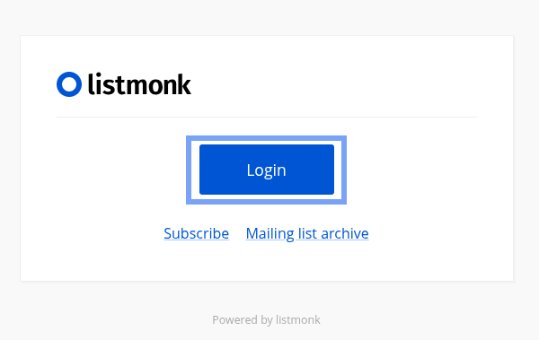
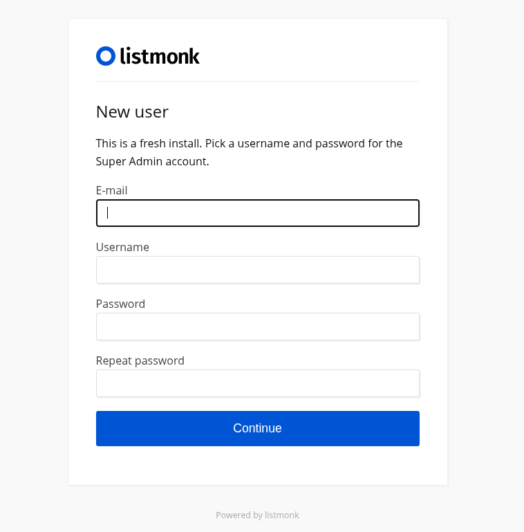
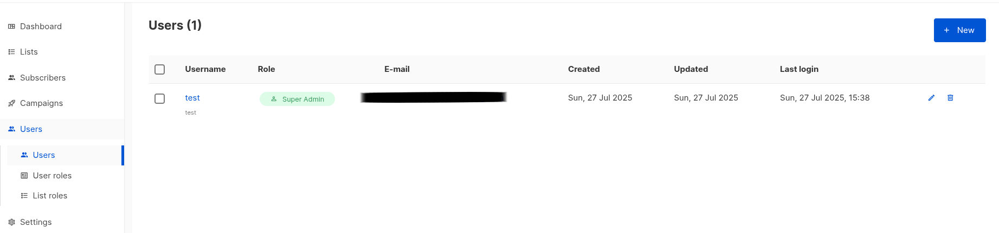
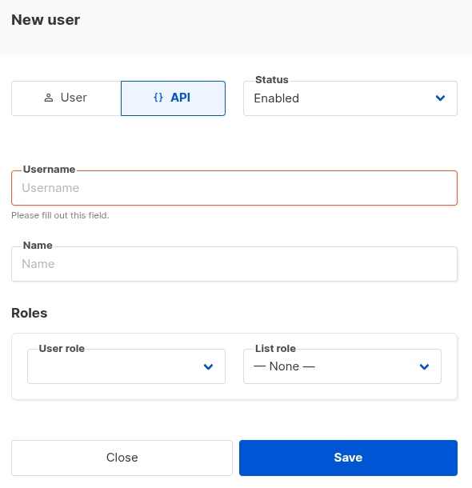
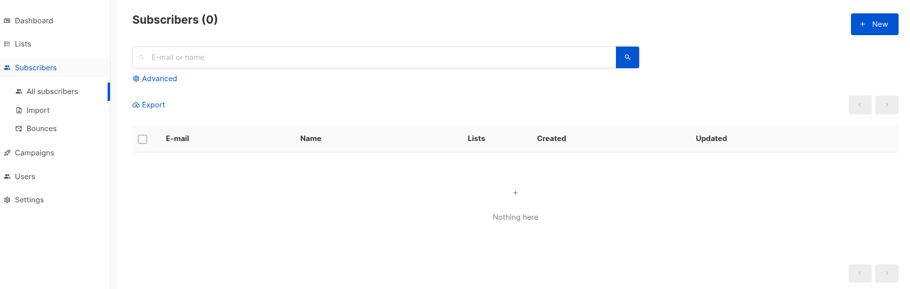
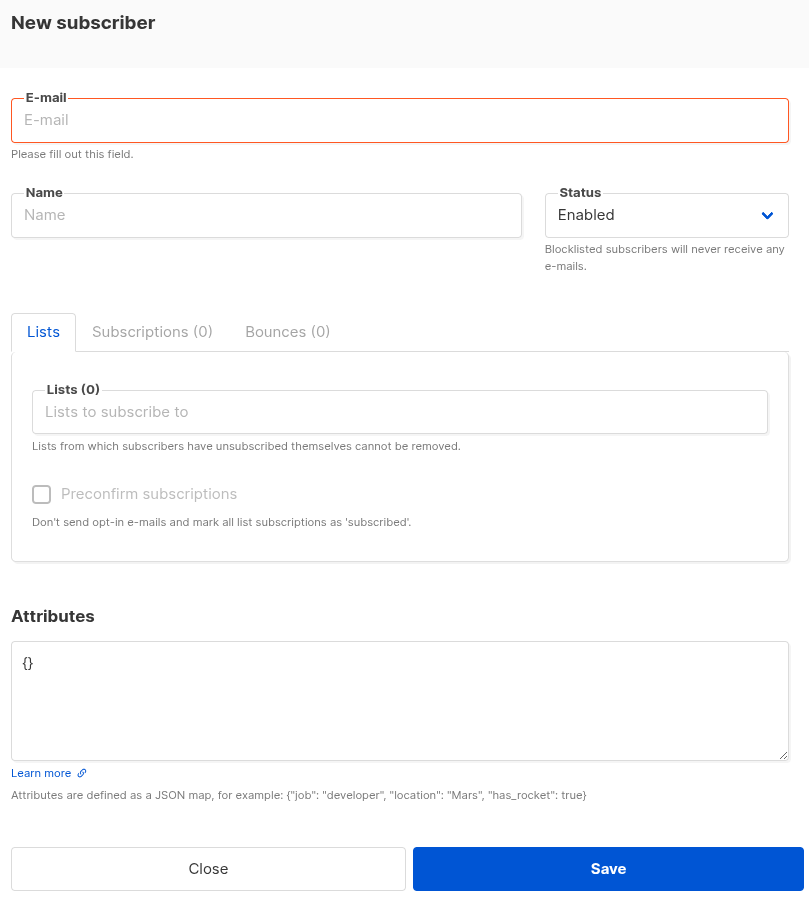
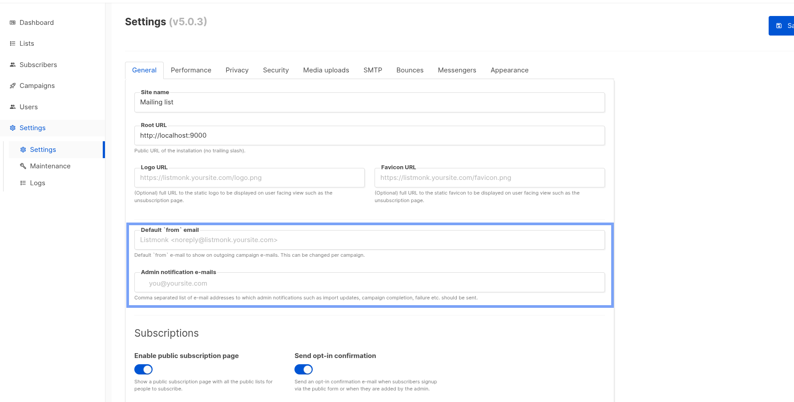
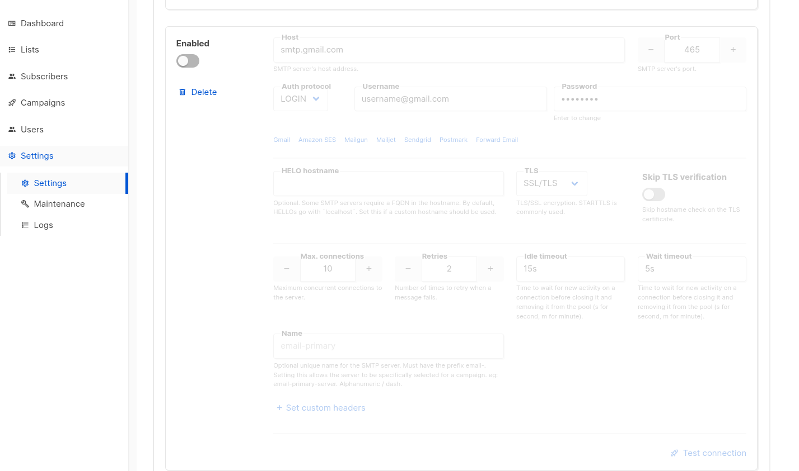

# Testing client

## Integration tests

### Running the listmonk server:

Download [listmonk](https://listmonk.app/) docker compose file

```bash
curl -LO https://github.com/knadh/listmonk/raw/master/docker-compose.yml

docker compose up -d  # will run on localhost:9000 by default
```

### Configuration of the server

**Initial Setup**

After starting the server, visit http://localhost:9000 and follow the setup wizard:
1. Create an admin account (Press login)
   
   
2. Create an API user
   
   
3. Add at least one user in "Default List". "Default list" is expected to have list
   
   

**Set up the default email for campaigns and for notification (Optional)**



**Set up the SMTP connection**

Required for sending test email



### Environment Variables

Set the following environment variables for running the tests:

```bash
# Required
export LISTMONK_USER="listmonk"
export LISTMONK_API_KEY="your_api_key"

# Optional (defaults shown)
export LISTMONK_TEST_URL="http://localhost:9000"
export LISTMONK_FROM_EMAIL="My Newsletter <hello@example.com>"
export TEST_EMAIL="your_email@example.com"  # For email sending tests
```

### Running the test suite

The integration tests are disabled by default. To enable them, use the `pytest` marker for integration tests. For example:

```bash
pytest -m listmonk_integration
```

**Enabling Send Test Email**

By default, the test email sending is not tested.
To enable it:
1. Ensure the integration test marker is enabled.
2. Configure the mail settings in the listmonk server.
3. Set the TEST_EMAIL environment variable to a valid email address.

Run the following command to enable and test email sending functionality:

```bash
pytest -m listmonk_integration --enable-mail
```

Once both are enabled, you can test email sending functionality as part of the integration tests.


### Troubleshooting

**API Authentication Errors**
If you receive 401 Unauthorized errors:
- Verify your API user and key match the environment variables
- Check that the API user has sufficient permissions in listmonk

**List ID Issues**
Tests expect the default list to have ID=2. If your setup differs:
- Set `export LISTMONK_TEST_LIST_ID=X` where X is your list ID
- You can find your list ID in the listmonk UI under Lists

**SMTP Connection Problems**
If email sending tests fail:
- Verify your SMTP settings in the listmonk UI
